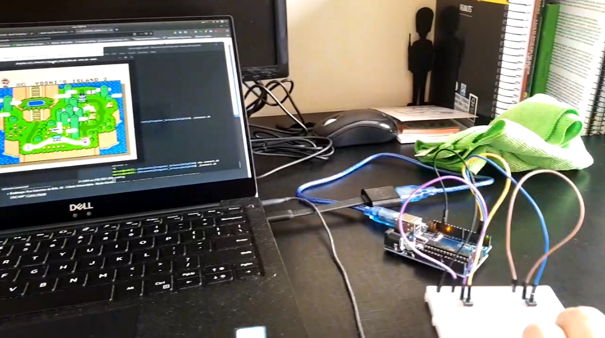

# DolphINO
Little project to use Arduino pushbuttons as input to the Dolphin emulator

Tested on Ubuntu 18.04.2 LTS

Dolphin pipe input documentation: https://wiki.dolphin-emu.org/index.php?title=Pipe_Input

## Instructions
* Connect the pushbuttons to pins 2 and 3
* Copy WiimoteNew.ini to ~/.config/dolphin-emu (or wherever dolphin sabes your controller config)
* Create a Dolphin pipe (mkfifo pipe1 on wherever Dolphin reads pipes - for me its ~/.local/share/dolphin-emu/Pipes)
* Upload controller code to board
* Give execution permission to connect.sh (chmod +x connect.sh)
* Start Dolphin emulator 
* Run connect script
* Test buttons on Dolphin
